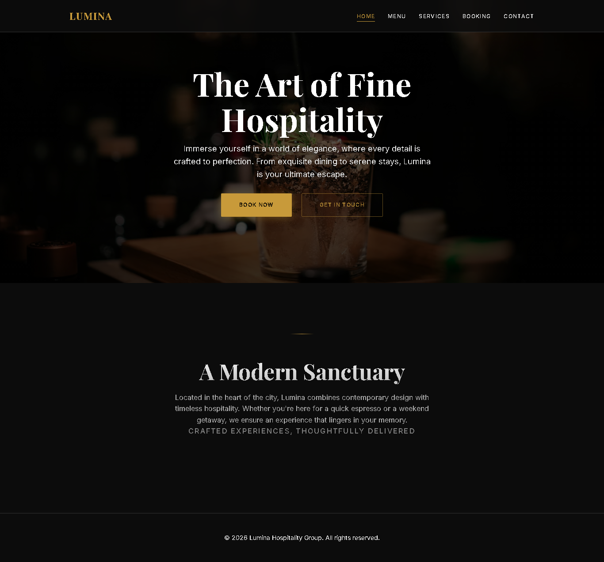

# Lumina — Restaurant Website

A responsive restaurant website focused on polished presentation, accessible forms, and a functional reservation experience.

## Overview

Lumina is a fictional hospitality website designed to demonstrate how a restaurant can present its brand, menu, services, booking flow, and contact information through a cohesive web experience.

The project combines visual design with practical frontend interactions rather than serving as a static landing page.

> **Note:** Lumina is a fictional portfolio project. Reservations are handled locally in the browser and are not connected to a real restaurant or backend service.

## Pages

- **Home** — Restaurant introduction and primary calls to action
- **Menu** — Food and drink presentation with filtering
- **Services** — Hospitality and restaurant services
- **Booking** — Reservation form with validation and confirmation feedback
- **Contact** — Contact information and inquiry section

## Features

- Responsive navigation and layouts
- Menu filtering with an empty-state message
- Reservation form validation
- Prevention of past-date reservations
- Generated reservation IDs
- Booking persistence with `localStorage`
- Accessible form labels and error messaging
- Keyboard-friendly focus states
- Descriptive image `alt` text
- Lazy-loaded images

## Technical Highlights

### Form validation

The booking flow validates required fields, name length, phone format, and reservation date before allowing submission.

### Client-side persistence

Submitted reservations are stored in the browser using `localStorage`.

### Accessibility

The site uses semantic HTML, labelled form controls, accessible error messaging, and visible `focus-visible` states to improve keyboard navigation.

## Tech Stack

- HTML5
- CSS3
- Vanilla JavaScript
- Google Fonts
- Font Awesome

## What This Project Demonstrates

- Business-focused website design
- Responsive frontend development
- Form validation and interaction design
- Browser storage
- Accessibility-minded implementation
- Clear calls to action and user flows

## Portfolio Note

Lumina is one of my flagship service-business website projects, demonstrating how I approach polished frontend websites for real-world businesses.

---

**Built by Estif**
